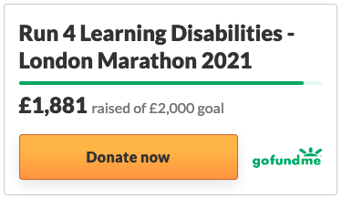

# Hi everyone 👋

My name is **Nicola** (he/him) and if there is one thing that wakes me up in the morning...this is **open source development** 🐧!

- ❤️ I'm currently maintaining several open source libraries such as [Detekt](https://github.com/detekt/detekt), [Chucker](https://github.com/ChuckerTeam/chucker), [AppIntro](https://github.com/AppIntro/AppIntro) and more.
- 🎙 If you're into open source, make sure you don't miss my podcast: [**The Developers' Bakery**](https://thebakery.dev)
- 📫 How to reach me: [@cortinico on Twitter](https://twitter.com/cortinico) - [corti.nico@gmail.com](mailto:corti.nico@gmail.com)

🇺🇦 Are you enjoying some of my libraries? Then [consider donating to my Ukraine Fundraising 🏃‍♂️](https://bit.ly/run-4-ukraine) to support **medical and financial aid to war refugees**. 🇺🇦 

  

100% of the collected funds will be donated to the [British Ukrainian AID](https://british-ukrainianaid.org/) ❤️

You can also [get some free stickers](https://twitter.com/cortinico/status/1438428384598573058) by donating 😱

I'll be happy to offer you a coffee once we meet in person ☕️.
